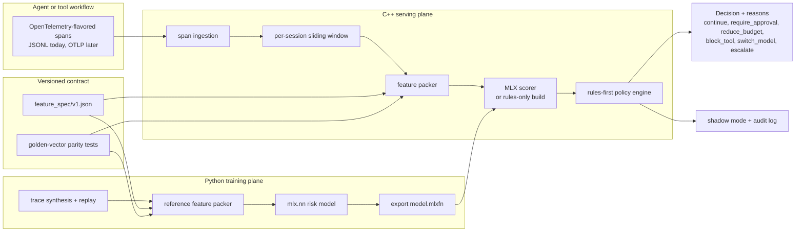

# ActWarden

**A learned runtime governor for AI agents and tool workflows, built on [MLX](https://github.com/ml-explore/mlx).**

> This repository is a fork of Apple's [ml-explore/mlx](https://github.com/ml-explore/mlx).
> Everything outside `actwarden/` and `docs/architecture/` is upstream MLX (see the
> [MLX documentation](https://ml-explore.github.io/mlx/build/html/index.html)); upstream remains
> fully buildable, and ActWarden lives in its own self-contained subtree so upstream merges stay
> clean. All credit for MLX goes to its authors — see [Citing MLX](#citing-mlx).

## What it does

AI agents fail in operational ways that prompt engineering doesn't fix: runaway tool loops, cost
blowups, repeated tool failures, dead-end planning, low-confidence retrieval cascades, unsafe tool
combinations. ActWarden watches an agent's execution trace as it happens and returns explainable
control decisions:

`continue · require_approval · reduce_budget · block_tool · switch_model · escalate`

It works in two planes with a deliberately narrow boundary:

- **Python trains.** Trace synthesis and replay, the reference feature packer, a compact
  `mlx.nn` risk model, offline evaluation, export.
- **C++ serves.** OpenTelemetry-flavored span ingestion, per-session sliding-window feature
  packing, sub-millisecond scoring via `mx::import_function` on an exported `.mlxfn` (weights
  baked in — no Python at serve time), and a rules-first policy engine where the learned model
  can only *add* caution, never remove it.

The two planes agree through one versioned contract, `actwarden/feature_spec/v1.json`, enforced
by golden-vector parity tests — train/serve skew is treated as a test failure, not a code review
comment. Full design: [`docs/architecture/overview.md`](docs/architecture/overview.md).

## Overview



## Status

Working vertical slice, no model artifact yet. What exists and is test-verified today: the
feature spec; the Python reference packer with golden vectors; **C++ feature packing at full
parity** with the reference (golden-gated); the rules-first policy engine; a CLI with shadow
mode (`--shadow`: evaluate everything, enforce nothing, report `proposed_action`), a
tamper-evident append-only audit log (`--audit-log`, FNV-1a hash chain, verifiable offline via
`actwarden.replay.verify_audit_log`), and a `--bench` hook; a rules-only build
(`-DACTWARDEN_ENABLE_MLX=OFF`) for boxes without MLX; agent instrumentation middleware
(`actwarden.instrument`) plus a runnable example (`actwarden/examples/toy_agent.py`); and a CPU
container whose build runs the parity suite as a gate. The train→export→import→score boundary
is smoke-tested. Not yet: a committed trained model, hysteresis/calibration, OTLP receiver,
CI-executed containers, MLX-enabled benchmarks. No enterprise claims implied.

## Layout

```
actwarden/
  feature_spec/v1.json      the Python↔C++ contract (single source of truth)
  python/                   training plane (pip package `actwarden`)
  runtime/                  serving plane (C++20, links in-tree MLX)
  examples/                 instrumented toy agent (end-to-end demo)
  fixtures/                 synthetic traces + golden feature vectors
  docker/                   Linux CPU / CUDA build targets
docs/architecture/          design notes
Makefile                    developer entry points (make help)
<everything else>           upstream MLX (plus this README and the Makefile)
```

## Quickstart

A root `Makefile` wraps the common workflows. Start with:

```bash
make doctor          # checks prerequisites, prints install hints
```

Prerequisites on macOS: Xcode Command Line Tools (`xcode-select --install`) and CMake
(`brew install cmake`). MLX cannot build without CMake; until it's installed,
`make build-rules-only` compiles the rules-only CLI with just a C++ compiler
(needs `brew install nlohmann-json`).

```bash
pip install -e "actwarden/python[dev]"   # add [train] for MLX
make build           # CMake + in-tree MLX (Metal on macOS; CUDA=1 on NVIDIA Linux)
make test            # full suite; C++ parity tests activate once a CLI exists
make demo            # instrumented toy agent → shadow scoring → audit verify
make bench           # pack(+score) latency microbench
make verify          # format-check + tests (pre-commit gate)
```

Equivalent raw commands, if you prefer them:

```bash
python -m pytest actwarden/python/tests -q

# macOS on Apple Silicon (Metal) — primary dev path
cmake -S actwarden/runtime -B actwarden/runtime/build
cmake --build actwarden/runtime/build -j

# Linux CPU                          # Linux + NVIDIA (CUDA backend)
#   add -DMLX_BUILD_METAL=OFF        #   add -DMLX_BUILD_METAL=OFF -DMLX_BUILD_CUDA=ON

./actwarden/runtime/build/actwarden \
  --trace actwarden/fixtures/traces/runaway_loop.jsonl \
  --spec  actwarden/feature_spec/v1.json \
  --shadow --audit-log /tmp/audit.jsonl     # observe-only + tamper-evident log
```

Instrument your own agent and score a real trace:

```bash
PYTHONPATH=actwarden/python python3 actwarden/examples/toy_agent.py /tmp/toy.jsonl
./actwarden/runtime/build/actwarden --trace /tmp/toy.jsonl \
  --spec actwarden/feature_spec/v1.json --shadow --bench 1000
```

## Deployment targets

| Target | Backend | Status |
|---|---|---|
| macOS arm64 (M-series) | Metal | primary development path |
| Linux CPU | CPU | builds MLX from source; intended for CI and small deployments; container written, not yet CI-verified |
| Linux + NVIDIA | CUDA | newest MLX backend; container is best-effort and expected to need iteration |

Training on Apple Silicon and serving on Linux is a real workflow here because the `.mlxfn`
export is platform-independent graph + weights; performance characteristics differ per backend
and no numbers are claimed until benchmarks land in-repo.

## Citing MLX

ActWarden is built on MLX, initially developed with equal contribution by Awni Hannun, Jagrit
Digani, Angelos Katharopoulos, and Ronan Collobert. Per the upstream request, if you use this
fork's MLX components in research, cite:

```text
@software{mlx2023,
  author = {Awni Hannun and Jagrit Digani and Angelos Katharopoulos and Ronan Collobert},
  title = {{MLX}: Efficient and flexible machine learning on Apple silicon},
  url = {https://github.com/ml-explore},
  version = {0.0},
  year = {2023},
}
```

MLX is MIT-licensed (see [LICENSE](LICENSE), [ACKNOWLEDGMENTS.md](ACKNOWLEDGMENTS.md),
[CITATION.cff](CITATION.cff)); ActWarden additions carry the same license.
